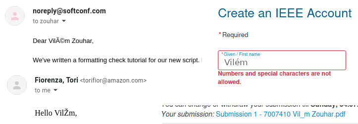

---
title:
- Assignment 3,4 + Compression
subtitle: |
    | (SNLP Tutorial 4)
author:
- Vilém Zouhar, Awantee Deshpande, Julius Steuer
theme:
- Boadilla
date: 18th, 20th May 2021
aspectratio: 169
header-includes:
  - \AtBeginDocument{}
---

# Assignment 3

- Exercise 1: Entropy Intuition
- Exercise 2: Uncertainty of events
- Exercise 3: KL Divergence
- Bonus: KL Divergence calculation

# Compression

- Prefix Codes: No whole code word is a prefix of any other code word 
- Uniquely decodable codes: Each word maps to one and only one code word

. . .

Prefix codes are a subset of uniquely decodable codes!

::: frame
## Optimal length of code words
$$l_i = -\log_D p(w_i)$$ <!--What does this imply? The most frequent words will have the shortest code lengths -->
:::

# Kraft's Inequality

$$\sum_{i=1}^m D^{-l_i} \le 1$$

> What does the sum < 1 imply? <!-- Redundancy -->

> What does the sum = 1 imply? <!-- Complete code -->

> What does the sum > 1 imply? <!-- Not uniquely decodable -->

> What does this tell us about uniquely decodable and prefix codes? <!-- Given a uniquely decodable code, we can construct a prefix code with the same lengths --->

## Exercise: Test Kraft's Inequality on Morse Code
(Hint: What is the encoding alphabet?)

# Kraft's Inequality

\centering

$$\sum_{i=1}^m D^{-l_i} \le 1$$

{width=500px}


# ASCII/UTF{8,16,32}/Unicode

Encoding from characters to binary alphabet:

::: frame
## ASCII: 7 bits (byte was standardized to 8 bits later!)
- Q: How many values? <!-- 128 -->
- Q: It has to be aligned to 8 bits nowadays (modern CPU requirement). \newline What do we with the eight bit?
:::

. . .

::: frame
## Windows-1252, Windows-1250
- Full 8 bits, map lower 128 to ASCII
- Individual differences, different encoding for í
:::

. . .

::: frame
## UTF
- Encoding over Unicode (character alphabet)
<!-- - - Windows nowadays uses UTF16 and refers to it as Unicode -->
- UTF8 - Start with 8 bits, extend to 16 or 32; UTF32 - Always 32 bits
- Compositionality: i with little tail and acute accent `U+0301U+0328U+0069`
- Valid misuse: snowman `U+0301U+0328U+2603`
:::

# Encoding - Internet


::: columns
:::: {.column width="35%"}
- Stacks:
- - OS, browser, HTTP
- - server (+ frameworks), database (running a different OS)
- - font rendering, memory order, BOM
- - kerning, text direction, etc

\centering

{width=200px}

::::
:::: {.column width="65%"}
\centering

{width=250px}

{width=300px}
::::
:::

# Encoding

::: frame
## Task
Create encoding (binary) for the following recipe: 

\footnotesize `apple apple banana cherries apple dark_chocolate eggplant banana cherries banana ...`

{width=20px}
{width=20px}
{width=20px}
{width=20px}
{width=20px}
{width=20px}
{width=20px}
{width=20px}
{width=20px}
{width=20px}
{width=20px}
{width=20px}
{width=20px}
{width=20px}
:::

. . .

::: frame
## Fixed-width encoding
{width=20px} `000` \qquad
{width=20px} `001`  \qquad
{width=20px} `010` \qquad
{width=20px} `011` \qquad
{width=20px} `100` \qquad
{width=20px} `101` \qquad

Length = $14 \times 3 = 42$ 
:::

::: frame
## Issues?
- Encoding for {width=20px} and {width=20px}?
- What do `110` and `111` mean? <!-- Are we underutilizing the channel?  -->
:::

# Encoding - Huffman

<!-- space for showing of huffman -->

\vspace{6cm}

::: frame
##
$4\times$ {width=20px} A \qquad
$4\times$ {width=20px} B \qquad 
$2\times$ {width=20px} C \qquad
$2\times$ {width=20px} E \qquad
$1\times$ {width=20px} D \qquad
$1\times$ {width=20px} F \qquad
:::

# Huffman Bonus

> - When will the Huffman tree be balanced?
> - How do we store the tree? Does the efficiency of this matter? 
> - Are there undefined sequences of bits when using Huffman encoding? <!-- at most one -->
> - Does the result of Huffman encoding depend on the text ordering? \newline
E.g. 
{width=20px}
{width=20px}
{width=20px}
{width=20px}
vs.
{width=20px}
{width=20px}
{width=20px}
{width=20px}
> - Can there be two equally good Huffman encodings?
> - Can Huffman result in assigning an element code of length 1?

# Long Range Dependencies
<!---  Write the formulae and explain --->
- Correlation <!-- c_d = p_d(w, w)/p(w)^2-->
- Conditional entropy <!-- E_p[-log p(x|y)] -->

# Assignment 4

- Exercise 1: Encodings (ASCII, UTF, Huffman)
```
      a = "Hellp there!"
      a[4] = 'o'
```
<!-- substitute_character(string=a, pos=4, newchar='o') -->

- Exercise 2: Conditional Entropy on DNA
- Bonus: Huffman Encoding alphabet

# Resources

1. Twitter emojis
2. https://www.ics.uci.edu/~dan/pubs/DC-Sec1.html
3. https://en.wikipedia.org/wiki/Shannon%27s_source_coding_theorem
4. https://en.wikipedia.org/wiki/Huffman_coding
5. http://www.mss.cbi.fau.de/content/uploads/epnat.pdf
6. https://arxiv.org/pdf/adap-org/9507007.pdf
7. https://en.wikipedia.org/wiki/Windows_code_page
8. https://r12a.github.io/app-conversion/
9. https://en.wikipedia.org/wiki/Kraft%E2%80%93McMillan_inequality
10. https://www.freecodecamp.org/news/everything-you-need-to-know-about-encoding/