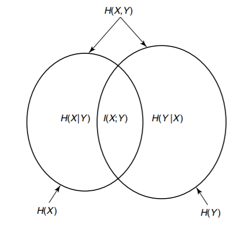
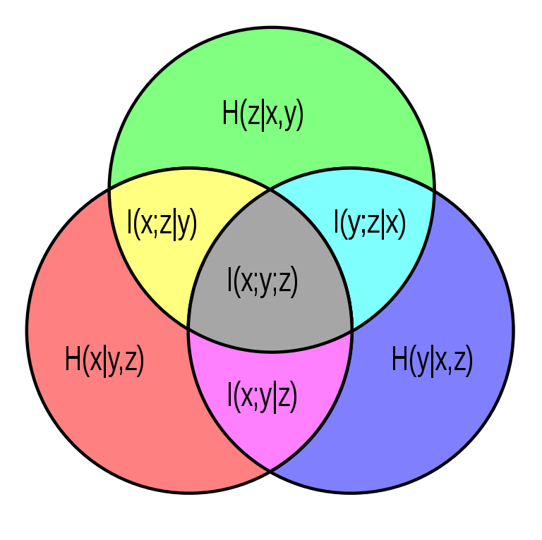

---
title:
- Assignment 2 + Information Theory
subtitle: |
    | (SNLP Tutorial 3)
author:
- Vilém Zouhar, Awantee Deshpande, Julius Steuer
theme:
- Boadilla
date: 11th, 12th May 2021
aspectratio: 169
header-includes:
  - \AtBeginDocument{}
---

# Assignment 2

- Exercise 1: Perplexity Calculation
- Exercise 2: Formulating n-gram models
- Exercise 3: Perplexity Calculation for n-grams
- Bonus: Alternative metric to perplexity

# Overview of Formulas

Concepts and formulations. 

::: columns
:::: column
- Information Content
- Entropy
- Joint entropy
- Conditional entropy
- Mutual Information
- Cross-entropy
- KL-Divergence
::::

. . .

:::: {.column width="65%"}
> - $I(x) = - \log p(x)$
> - $H(X) = - \sum_{x \in X} p(x) \cdot \log p(x)$
> - $H(X,Y) = - \sum_{x \in X} \sum_{y \in Y} p(x,y) \cdot \log p(x,y)$
> - $H(X \mid Y) = - \sum_{x \in X} \sum_{y \in Y} p(x,y) \cdot \log p(y \mid x)$
> - $I(X;Y) = - \sum_{x,y} p(x,y) \cdot \log \frac{p(x,y)}{p(x) \cdot p(y)}$
> - $H(p,q) = - \sum_{x,y} p(x) \cdot \log q(y)$
> - $D(p || q) = -\sum_{x \in X} p(x) \cdot \log \frac{p(x)}{q(x)}$
::::
:::

# How do they relate to each other?

- Chain Rule:
$$H(X,Y) = H(X) + H(Y|X)$$
$$H(X_1...X_n) = H(X_1) + H(X_2 \mid X_1) + ... + H(X_n \mid X_1,...,X_{n-1})$$

. . .

- Mutual Information and Entropy
$$I(X;Y) = H(X) - H(X \mid Y) = H(X) + H(Y) - H(X,Y)$$

. . .

- Apply to 3 variables
$$I(X;Y \mid Z) = I((X;Y)|Z) = H(X \mid Z) - H(X \mid Y, Z)$$

# How do they relate to each other?
::: columns
:::: column
{width=250px}
\tiny Source: https://syncedreview.com/2020/11/30/synced-tradition-and-machine-learning-series-part-1-entropy/
::::

:::: column
{width=250px}
\tiny Source: https://en.wikipedia.org/wiki/Information_diagram
::::
:::

# Examples - Entropy calculation

+--------+-----+----+
| X \\ Y | 0   | 1  |
+========+=====+====+
| 0      | 1/2 | 1/6|
+--------+-----+----+
| 1      | 1/3 | 0  |
+--------+-----+----+

Find

- $H(X), H(Y)$
- $H(X, Y)$
- $H(X | Y), H(Y | X)$
- $I(X;Y)$
- $H(Y) - H(Y | X)$

# Examples - Entropy of functions

What is the (in)equality relationship between H(X) and H(Y) when

- $y = f(x)$ # general case
- $y = 2^x$
- $y = sin(x)$

# KL-divergence

::: frame
## Question: Can we use the chain rule on KL-Divergence?

. . .

$$D(p(x,y) \mid \mid q(x,y)) = D(p(x) \mid \mid q(x)) + D(p(y \mid x) \mid \mid q(y \mid x))$$
:::

Applications of KL Divergence:

- Bayesian inference
- Compression techniques
- Variational autoencoders

# Assignment 3

- Exercise 1: Understanding entropy in languages
- Exercise 2: Entropy as a measure of uncertainty
- Exercise 3: KL Divergence properties
- Bonus: Computation of KL Divergence

# Resources

1. http://csustan.csustan.edu/~tom/sfi-csss/info-theory/info-lec.pdf
2. https://www.cs.cmu.edu/~odonnell/toolkit13/lecture20.pdf
3. https://syncedreview.com/2020/11/30/synced-tradition-and-machine-learning-series-part-1-entropy/