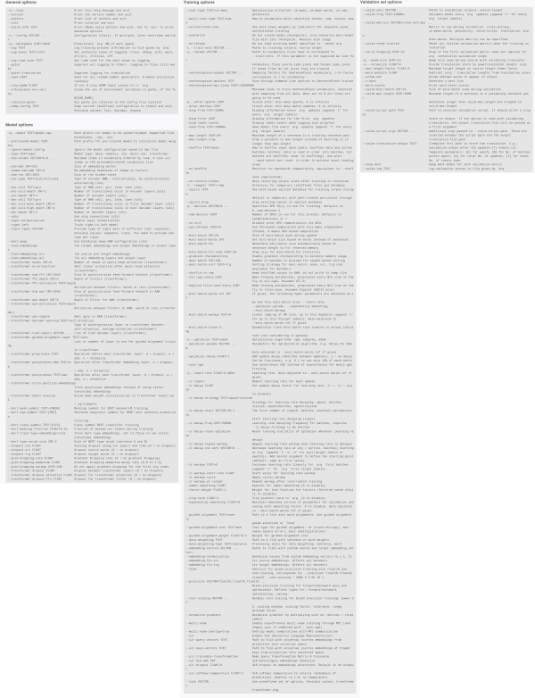

---
title:
- "Statistical Machine Translation"
subtitle: |
    | \{Phrase-Based,Vanilla Neural\}
    | (SNLP tutorial)
author:
- Vilém Zouhar
theme:
- Boadilla
date: \today
aspectratio: 169

documentclass: beamer
# classoption: notes
---

# Overview

\begin{itemize}
\setlength{\itemsep}{-0.2cm}
\item Task, metrics
\item PBMT
\item - Alignment - Phrase extraction
\item - Decoding
\item - - Proof of NP-hardness
\item - - Log-linear model
\item - Alignment - IBM{1,2,3,4,5}
\item NMT
\item - Encoder-Decoder
\item - Embedding 
\item - Example
\item Homework
\end{itemize}

# Task

> - Given source $s$, output target $t$: $argmax_t \{p(t|s)\}$
> - $= argmax_t\{p(s|t)/p(s)\cdot p(t)\}$
> - $= argmax_t\{p(s|t) \cdot p(t)\}$ 
> - Modelling $p(s|t)$ is as hard/easy as $p(t|s)$ \newline
    Modelling $p(t)$ is easier 

# Approaches

::: columns

:::: column
- RBMT (rule-based)
- EBMT (example-based)
- SMT (statistical)
- - PBMT (phrase-based)
- - NMT (neural)
::::

:::: column

![Vauquois Triangle; Source [7]](img/vauquois_triangle.png){width=100%}

::::
:::

\note{
    - Rule-based methods are now a history, though one interesting concept is this triangle.
    - Machine translation is split into analysis, transfer and synthesis.
    - Example based machine translation is heavily used even today by translation companies, which keep and build translation memories.
    - SMT has two parts: phrase based and neural.
    - Rule-based are still used in post editing after NMT
}

# Metrics - BLEU

\begin{block}{BLEU}
Reference $r$, Candidate $c$

$$ \min(1, exp(1-|r|/|c|)) \times (p_1\cdot p_2\cdot p_3\cdot p_4)^{1/4} $$
\end{block}

- Brevity penalty $\times$ geom. average of precisions
- Score 0-100% (usually without the percentage)

Reference: \qquad\qquad\hspace{0.05cm} What is the purpose of all this ? \newline
Hypothesis: \qquad\qquad  What is the meaning of all this ? \newline
matching 3-grams: \quad (What, is, the), (of, all, this), (all, this, ?) \newline
total 3-grams: \qquad\quad  6 \newline
$\rightarrow$ \newline
$p_3 = 3/6 = 1/2$ \newline
$p_1 = 7/8, p_2 = 5/7, p_4 = 1/5$, BP = $1$, BLEU = $50$. 

# Metrics

- Many more: ChrF, TER, METEOR
- Every MT metrics faces criticism (~90% correlation with humans [5])
- Human judgement **inconsistent**
- SoTA German-English: ~40
- Strongly depends on:
- - Tokenization scheme (+10 BLEU(!))
- - Used corpus
- _Always_ use existing BLEU implementation and standardized test sets [6]

# Components of PBMT

- Alignment
- - Extracting phrases
- Decoding
- - Covering the source sentence with extracted phrases
- - Scoring "coverings" using a language model 

# Phrase Extraction

::: columns

:::: column
- Extract all consistent phrases
- _if you were there_
- _if you were there you would know it now_
- _you would_
- _know it_
- _you would know it now_
- _..._
- Extracted phrases have to be "full" - no gaps that are aligned outside of the extraction
- Similar concept to projectivity
::::

:::: column
![Consistent and inconsistent phrases; Source [2]](img/word_matrix.png){height=70%}

::::

:::

# Decoding

- Cover the source sentence with extracted phrases

![Covering of source sentence; Source [1]](img/decoder_cover.png){width=100%}


# Beam search

- Start with 0 coverage and keep track of already covered words
- Estimate the cost of the existing phrases (language model) (+ future cost)

![Partially expanded beam search; Source [1]](img/beam_search.png){width=73%}

# Beam search - NP-complete

1. Consider travelling salesman / hamilton circuit
2. $LM(x,y) = -\log dist(x, y)$
3. $LM$: prohibit repetitions\newline
   $LM$: add the distance between the first and the last word
4. Source sentence: `NULL-NULL-NULL-NULL-...` \newline
   `NULL` can be covered by any city/node
5. Beam search finds the most probable / cheapest ordering:\newline
   `NewYork-Boston-Trenton-...`

<br>

- MT beam search solves the traveling salesman problem $\rightarrow$ vanilla beam search is NP-hard.
- Future cost estimation is used + top N hypothesis paths considered (rest pruned).
- Polynomial, but no optimal solution guarantee.

# PBMT Log-linear Model

- Not statistically sound, but:
- $t = argmax_t\{p(s|t) \cdot p(t)^2\}$ for more fluent output
- $t = argmax_t\{p(t|s) \cdot p(t)^2\}$ works equally well

. . .

Log-linear model:

> - $t = argmax_t\ exp(\sum_{\text{feature } f} \lambda_f f(e, t))$
> - Adequacy: $f_{TM}(e,t) = \log p(t|s)$\
> - Language model: $f_{LM}(e,t) = \log p(t)$\
> - $f_{Phr}(e,t) = \textit{number of covering phrases}, \lambda_{Phr} = -1 \textit{ (e.g.)}$\newline
    Perhaps we want larger phrases to cover the source sentence

\note{
    - The reason for this notation is that it makes it easy to combine language and adequacy modelling as well as other restrictions. 
}

# Alignment

> - Soft alignment: values in the interval $[0,1]$ instead of hard decisions $\{0,1\}$

> - Given an alignment (A), can we construct word translation probabilities (T)?
> - Yes: $T(x|y) = \frac{\sum_{\text{sents } s, t} A_{s,t}(x|y)}{T(\cdot|y)}$
> - Given word translation probabilities (T), can we construct word alignment (A)? 
> - Yes: $A_{s,t}(x|y) = \frac{T(x|y)}{\sum_{u \in s} T(u|y)}$
> - If we start from $A^1$, then compute $T^1$ and then $A^2$, will $A^1 = A^2$?
> - No, in most cases.
> - Main idea behind Expectation-Maximization: change "views" e.g. 5 times.
> - Start with $A^0_{s,t}(x|y) = \frac{1}{|s|}$ (uniform distribution)

# IBM Model 1 Code

```
# expectation
words_prob = np.zeros((len(words2), len(words1)))
for (sent_src, sent_tgt), probs in zip(sents, alignment_probs):
    for word_tgt, probline in zip(sent_tgt, probs):
        for word_src, prob in zip(sent_src, probline):
            words_prob[word_tgt][word_src] += prob
# normalize rows
words_prob = (words_prob.T / np.sum(words_prob, axis=1)).T

# maximization
for sent_i, (sent_src, sent_tgt) in enumerate(sents):
    for pos_src, word_src in enumerate(sent_src):
        for pos_tgt, word_tgt in enumerate(sent_tgt):
            probs[pos_tgt][pos_src] = words_prob[word_tgt][word_src]
    # normalize sentence columns
    alignment_probs[sent_i] = probs / np.sum(probs, axis=0)
```

# IBM Model 1 - Hard alignment

- At the end, take $H_{s,t}(y) = argmax_{x} (A_{s,t}(x|y))$ 
- Assumption: every target token is aligned to exactly one source token
- What about alignment between a Slavic language without articles and a Germanic one, with articles?
- - Czech-German [3]: 24% target tokens unaligned
- - Czech-German [3]: 1.1 aligned tokens per one target token (excluding unaligned)

. . .

Solution:

- Add NULL token to every sentence, then remove alignments to it in post-processing
- Use a different extraction method than argmax (threshold, dynamic threshold, ..)

. . .

\qquad \qquad \qquad \qquad \qquad \qquad \qquad $AER = \frac{|A\cap sure|+|A\cap poss|}{|A|+|S|}$

# IBM Model 2

{width=70%}

IBM Model 1: $p(s, \text{algn} |t) \propto \prod_{j=1}^{|s|} \text{trans} (s_j|t_{\text{algn}(j)})$ \newline
IBM Model 2: $p(s, \text{algn} |t) \propto \prod_{j=1}^{|s|} \text{trans} (s_j|t_{\text{algn}(j)}) \cdot a(i\rightarrow j,|t|,|s|)$ \newline
\qquad E.g. $\big|\frac{i}{|t|} - \frac{j}{|s|}\big|$

\note{
    - The IBM Model 2 introduces a new component, which just scores the probability of just an alignment
    - E.g. this way we may force diagonal alignment
}

# IBM Model 3

![Generative process of IBM3; Source [13]](img/ibm_3.png){height=75%}

\note{
    - The IBM model 3 deals with something called the fertility. That's a concept which captures the fact that for example in Spanish, the English word _slap_ is translated to three distinct words _dió una botefada_.
    - The fertility of every word can be again estimated using the parallel data. 
}

# IBM Model 4

- Work with classes
- Polish noun-adjective inversion:
- _train station_ $\rightarrow$ _stacja kolejowa_
- _[train:N] [station:N]_ $\rightarrow$ _[stacja:N] [kolejowa:Adj]_ (post-nominal)

\note{
    - IBM Model 4 conditions the alignment probability on word classes of the given word and also the surrounding ones.
    - A typical example is the polish noun-adjective inversion, which creates a prior to swap the alignment.
}

# IBM Model 5

- Alignment context
- Where to align _Übersetzung_ if we have low translation priors?

![Unfinished alignment process, German $\rightarrow$ Sotho (South Africa); [14]](img/ibm_5.svg){width=50%}

\note{
    - Finally, IBM model 5 takes the alignment context into consideration.
    - That is, it allows placement of words into places that have low translation mass.
    - In this example we may have little lexical knowledge
    - This can be compensated 
}

# Beyond IBM models

> - More heuristics and tricks:
> - - Align everything with levenstein distance at most e.g. $0.1$
> - - Align interpunction (`, . ?`)
> - - Precision is the biggest issue:\newline
      Compute multiple alignments and output their intersection
> - Use existing MT to get translation probabilities
> - Transformers (attention scores) for alignment

# NMT - Training

- Traditional NMT pipeline too big + lots of preprocessing
- End-to-end training

1. Embedd words in one-hot embedding:
```
        dog       = (1, 0, 0, 0, ...)
        cat       = (0, 1, 0, 0, ...)
        broccoli  = (0, 0, 1, 0, ...)
        broccolis = (0, 0, 0, 1, ...)
```
2. Feed the whole sentence sequentially into an RNN (vanilla, LSTM, GRU)
3. Get a hidden state representing the whole sentence
4. The output of this last step is the first translate word (distribution) \newline
    We know the correct word, start accumulating gradient
5. Push the output word into the hidden state, get next word
6. Repeat 4.+5. util `<EOS>` on the training sentence

# NMT - Translation

- Traditional NMT pipeline too big + lots of preprocessing
- End-to-end training

1. Embedd words in one-hot embedding
2. Feed the whole sentence sequentially into an RNN (vanilla, LSTM, GRU)
3. Get a hidden state representing the whole sentence
4. The output of this last step is the first translate word (distribution)
5. Push this word into the hidden state, get next word
6. Repeat 4.+5. util `<EOS>`

In 4. apply beam search or (since we have the probabilities) just take the max.

# NMT - Issues

> - Issue: The end of the sentence is represented best in the single hidden state
> - Lots of crucial information is at the beginning of the sentence \newline
    People judge the beginning much more than the rest
> - Solution: Feed in the sentence reverse
> - Solution: BiRNN
> - Solution: Explicit attention

> - Issue: Whole sentence meaning captured by a single vector
> - Solution: Explicit attention mechanism (also alleviates vanishing gradients) \newline
    Transformer architecture (encoder can also be parallelized)

> - Issue: |broccoli-broccolis|$_2^2$ = |broccoli-dog|$_2^2$
> - Solution: learn word embeddings from monolingual data \newline
    (word2vec: CBOW/skip-gram, Glove)
> - Also allows for basic arithmetics: king - man + woman = queen

# Tools

- Alignment:
- - fast\_align (easy to setup+run, fast, adjusted IBM2) [8]
- - (M)GIZA++ (more advanced, slightly better results) [9]
- PBMT:
- - Moses MT [10]
- NMT:
- - Marian NMT (fast, used by most in WMT, maintained, a bit harder to debug - C++) [11]
- - Huggingface's transformer (harder to setup, easy Python interop) [12]

# Code

::: columns
:::: column
Train:

```
marian \
  --train-sets corpus.en corpus.de \
  --vocabs vocab.en vocab.de \
  --model model.npz
```

. . .

\vspace{0.7cm}

Translate:

```
echo "This is a test." | marian-decoder \
 -m model.npz \
 -v vocab.en vocab.de

> _Das _hi er _ist _ein _Test _.
```
::::

. . .

:::: column
{width=60%}
::::
:::

# Homework

TBD

# References 1

1.  PBMT pipeline: <http://www.statmt.org/moses/?n=Moses.Background>
2.  Phrase extraction: <https://nlp.fi.muni.cz/en/MachineTranslation>
3.  Aligned CSEN corpus: <http://ufal.mff.cuni.cz/czech-english-manual-word-alignment>
4.  Capacity of a single $&!#* vector: <https://www.aclweb.org/anthology/P18-1198.pdf>
5.  BLEU-human annotation correlation: <https://www.aclweb.org/anthology/2020.wmt-1.41.pdf>
6.  Go-to BLEU implementation: <https://github.com/mjpost/sacreBLEU>
7.  SMT course: <http://ufal.mff.cuni.cz/courses/npfl087>
8.  fast_align: <https://github.com/clab/fast_align>
9.  GIZA++: <http://www.statmt.org/moses/giza/GIZA++.html>
10. Moses MT: <http://www.statmt.org/moses/>

# References 2

11. Marian NMT: <https://marian-nmt.github.io/>
12. Transformers: <https://huggingface.co/transformers/usage.html>
13. Stanford lecture: <https://web.stanford.edu/class/archive/cs/cs224n/cs224n.1114/handouts/cs224n-lecture-05-2011-MT.pdf>
14. Alignment visualizer: <https://vilda.net/s/slowalign/>