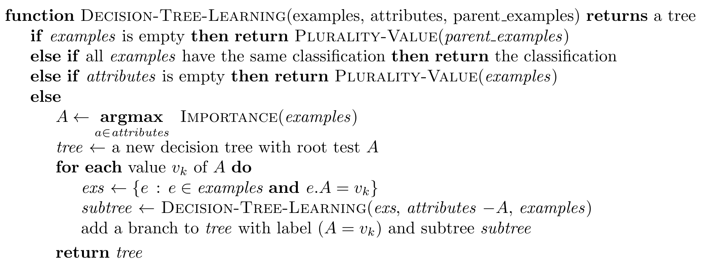
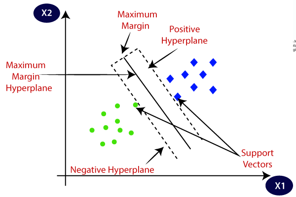

---
title:
- Assignment 8,9 + Classifiers
subtitle: |
    | (SNLP Tutorial 9)
author:
- Vilém Zouhar, Awantee Deshpande, Julius Steuer
theme:
- Boadilla
date: 22nd, 24th June
aspectratio: 169
header-includes:
  - \AtBeginDocument{\usepackage{graphicx}\usepackage{tikz}\usetikzlibrary{positioning,shapes,arrows}}

documentclass: beamer
# classoption: notes
---

# Assignment 8

- Exercise 1: Feature Selection (DF, PMI)
- Exercise 2: $\chi^2$
- Exercise 3: Author identification
- Bonus: Features for clustering

# Decision Trees

- What is a decision tree?

. . .

{width=450px}

##
What is plurality value? <!--most common value in examples-->

What is importance? <!--any metric like IG, Chi Square etc.-->

# Decision Trees - Questions
- Which of the 2 splits has a better information gain?

\center
{width=300px}

. . . 

\raggedright
- What are the pros and cons of decision trees?
<!--
Advantages: Less data preparation, no data scaling, missing values are okay
Disadvantages: Prone to overfitting, very sensitive to data rotation (not robust to change in data), high calculation and training time. Does not consider feature combinations i.e. only 1 feature at a time. 
-->

. . .

> - How to avoid overfitting? <!--Pruning, random forest-->
> - How to use decision trees for regression?

<!-- # Naïve Bayes

- Based on Bayes Theorem <!--write the formula
- Algorithm

{width=350px} -->

# Naïve Bayes

- Formula?

. . .

<!-- - Assume absolute independence except for the one observed variable -->
- $p(y=\text{Will rain}|x) = p(y_j|x) = \frac{p(x|y_j)p(y_j)}{p(x)} \propto p(x|y_j) p(y_j) \approx p(y_j) \prod_i p(x_i|y_j)$
- $\rightarrow \arg \max_{y_j} p(y_j) \prod_i p(x_i|y_j)$

\centering
\begin{tikzpicture}[
  node distance=0.5cm and 0cm,
  mynode/.style={draw,ellipse,text width=1.7cm,align=center},
  observed/.style={draw,rectangle,text width=1.7cm,align=center}
]
\node[mynode] at (0, 1.3) (clf) {Forecast};
\node[mynode] at (3, 1.3) (ra) {Cloudy};
\node[mynode] at (6, 1.3) (gw) {Foggy};
\node[observed] at (3, 0) (sp) {Rain};
\path
(sp) edge[latex-] (clf)
(sp) edge[latex-] (ra)
(sp) edge[latex-] (gw);
\end{tikzpicture}

##
- Why is Naive Bayes naive? 
- How is the prior of e.g. 90% probability of not raining (overall) modelled?
<!-- - Why is it Bayesian? -->
- What are the pros and cons?
<!--
Advantages: Works with lesser training data and less training time
Disadvantages: Assumes the features are independent and unweighted i.e. they contribute equally to the outcome, requires smoothing to handle unseen events.
-->

::: notes
- In Naïve Bayes we artificially flatten the network so that the observed variable is directly dependent to all causes and there are no other dependencies.
- The formula shows where the approximation is taking place.
- A practical example why this is naïve is that the variable _Rain_ is heavily dependent on the _Cloudy_ variable but as well on the _Foggy_, which in turn is almost the same thing as _Cloudy_. And if we put both all these in the formula, then we assign higher weight to the concept of _cloudyness_ than to _forecast_.
:::

# kNN

- What is it?

. . .

{width=350px}
\tiny Source: <www.researchgate.net/figure/Pseudocode-for-KNN-classification_fig7_260397165>

. . .

\normalsize
##
- What are the training and test computation times for kNN?
- What are the pros and cons of kNN classifiers?
<!--
Advantages: No training, robust to new data
Disadvantages: Scales poorly with large data or more dimensions, needs feature scaling, sensitive to outliers
-->
- Can kNN be used for regression? <!--yes, use average/max or similar metric-->

# SVM

- What is it?

. . .

::: columns
:::: column
- Find a boundary that maximizes the distance to closest vectors
- If not possible, find one that minimizes the error
- Add the kernel trick for non-linear data
::::

:::: column
{width=250px}
::::
:::

. . .

##
- What are the pros and cons of SVMs?
<!--
Advantages: Works well with clear separation boundary, effective for high dimensions esp. for sparse data (Ndim > Ndata), works very well with kernels
Disadvantages: Not suitable for large data, not robust to noise, no probabilistic explanation for classification, difficult to fine tune
-->
- Can SVMs be used for regression?

# Perceptron

::: columns
:::: column
- Binary classification
- Linear boundary in feature space
- $\hat{y} = \text{sign}(wx+b)$
::::

:::: column
Algorithm:

- $w_0 = \overrightarrow{0}$
- For every data point $x_i$
- $\hat{y_i} = \text{sign}(w_k x_i +b)$
- - if $\hat{y_i} \ne y_i$:
- - - $w_{k+1} = w_k - \hat{y_i} \cdot x$
- - else:
- - - $w_{k+1} = w_k$
::::
:::

. . .

##
- What are the pros and cons of simple perceptrons?
<!--
Advantages: Computationally efficient, guaranteed for linearly separable problems, converges to a global optimum
Disadvantages: ONLY linearly separable, difficult with many features
-->
- Can we extend this to non-linear data?

# Common Evaluation Measures

> - **Confusion matrix**
> - **Precision**
> - \qquad $\frac{TP}{TP+FP}$ (out of those marked as 1, how many are actually 1?)
> - **Recall**
> - \qquad $\frac{TP}{TN+FN}$ (out of all 1s, how many are marked 1?)
> - **F-{measure,score}**
> - \qquad $\frac{2 \cdot P \cdot R}{P + R}$ (weighted average of precision and recall) <!--Gives equal importance to FP and FN -->
> - **Accuracy**
> - \qquad $\frac{TP+TN}{TP+TN+FP+FN}$

::: notes
Precision - TP/PREdicted true values, Recall - TP/REal values
:::

# Useful Python Implementations

- <https://scikit-learn.org/stable/supervised_learning.html>

- Decision Trees: <https://scikit-learn.org/stable/modules/tree.html>

- Naive Bayes: <https://scikit-learn.org/stable/modules/naive_bayes.html>

- K Nearest Neighbour: <https://scikit-learn.org/stable/modules/neighbors.html>

- SVMs: <https://scikit-learn.org/stable/modules/svm.html>

- Perceptron: <https://scikit-learn.org/stable/modules/generated/sklearn.linear_model.Perceptron.html>

- Evaluation metrics: <https://scikit-learn.org/stable/modules/model_evaluation.html>

# Assignment 9

- Exercise 1: Text classification

- Bonus: Support Vector Machines

# Resources

1. UdS SNLP Class, WSD: <https://teaching.lsv.uni-saarland.de/snlp/>
2. Decision Trees: <https://www.kdnuggets.com/2020/01/decision-tree-algorithm-explained.html>
3. Naive Bayes Example: <https://medium.com/analytics-vidhya/naive-bayes-classifier-for-text-classification-556fabaf252b>
4. kNN Example: <https://iq.opengenus.org/text-classification-using-k-nearest-neighbors/>
5. SVM: <https://monkeylearn.com/blog/introduction-to-support-vector-machines-svm/>
6. Perceptron <https://machinelearningmastery.com/perceptron-algorithm-for-classification-in-python/>
7. Maximum Entropy Classifier: <http://cseweb.ucsd.edu/~elkan/254/ari_talk.pdf>