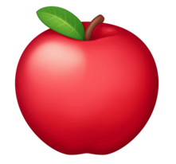
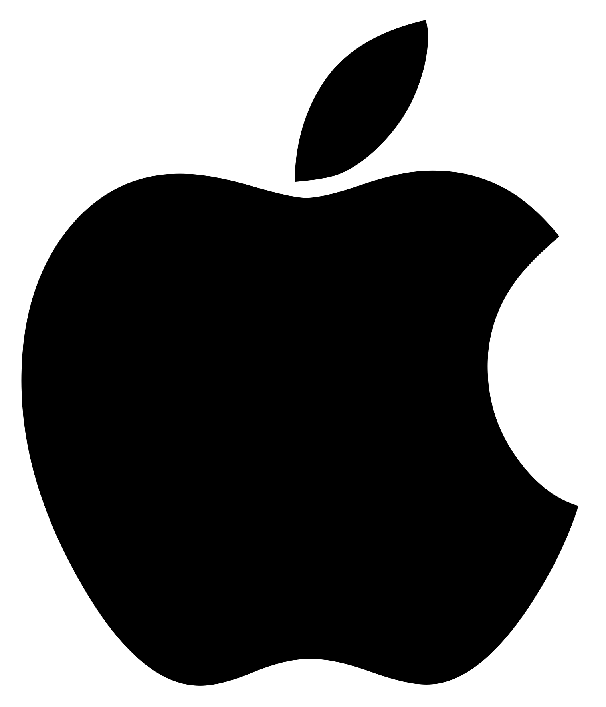

---
title:
- Word Sense Disambiguation
subtitle: |
    | (SNLP tutorial)
author:
- Vilém Zouhar
theme:
- Boadilla
date: \today
aspectratio: 169
header-includes:
  - \AtBeginDocument{}

documentclass: beamer
# classoption: notes
---

# Overview

\begin{itemize}
\setlength{\itemsep}{-0.2cm}
\item Task
\item One sense per ...
\item Dictionary-based
\item Supervised
\item Unsupervised
\item - Partitioning
\item - Flip-Flop Algorithm
\item - E-M Algorithm
\item - Yarowsky Algoritm
\item Notes
\item Homework
\end{itemize}

# Word Sense Disambiguation

\underline{Apple} is full of vitamins. \newline
\underline{Apple} was struggling last quarter. \newline
\underline{Apple} was thrown away from the meeting.

. . .

\centering 
{width=15%} \qquad \qquad \qquad {width=13%}

. . .

\vspace{0.5cm}

\raggedright
$f(w, C) = s \in S_w$ \newline
$f(\text{Apple}, \text{* was thrown away from the meeting}) \in \{\text{fruit}, \text{company}\}$

# Word Sense Disambiguation

Machine translation:

- Apfel ist voller Vitamine.
- Apple ist voller Vitamine.
- Apfel hatte im letzten Quartal Probleme. 
- Apple hatte im letzten Quartal Probleme. 

. . .

Information retrieval:

- Query: Apple vitamins
- Relevant document: benefits of eating apples

. . .

Dialogue systems

Spelling correction

# Task Difficulty

::: columns
:::: column
Humans:

- 98% for obvious meanings
- 65% for highly ambiguous words
- Sometimes impossible
::::

. . . 

:::: column
Most Common Class Classifier:

|Word|Meaning Count|Most Frequent|
|-|-|-|
|behavior|3|96%|
|band|24|73%|
|slight|8|67%|
|aware|2|58%|
|float|28|14%|
::::
:::

(Source for both [1])

# One sense per ...

One sense per discourse

- One meaning per word+documnet

. . .

One sense per collocation

- Nearby words help determine the sense

# Dictionary 

- Dictionary/Thesaurus: $\forall w, s \in S_w: D(s) = \text{ description of sense } s$
- Context: $\forall w, C(w) = \text{ context of word } w \text{ in a specific occurence}$

## Lesk's Algorithm

\centering
$\hat{s} = \arg \max_s \text{sim}(D(s), \cup_{x \in C(w)} D(x))$

::: frame
## Similarity

\vspace*{-0.4cm}
\begin{gather*}
\frac{2|X\cap Y|}{|X|+|Y|}
\qquad \qquad \frac{2|X\cap Y|}{|X\cup Y|}
\qquad \qquad \frac{|X\cap Y|}{\sqrt{|X|\cdot|Y|}}
\end{gather*}
:::

. . .

- Simple, fast
- Low performance

# Supervised Disambiguation

- Sequence Labelling / Classification

## Bayes Decision

\vspace*{-0.4cm}
\begin{align*}
\hat{s} &= \arg \max_s p(s|C) = \arg \max_s \frac{p(C|s)\cdot(p(s))}{p(C)} \\
&= \arg \max_s p(C|s)\cdot(p(s))
\end{align*}

## Naïve Bayes

\vspace*{-0.4cm}
\begin{align*}
p(C|s) = \prod_{x \in C} p(x|s)
\end{align*}

- Estimate by MLE counts (+ smoothing)
- Independence within context
- Position in context does not matter (can be alleviated by gaussian powers)

::: notes
- bag of words
:::

# Unsupervised Disambiguation

> - Machine translation is able to choose the right sense \newline
  (assuming different senses have different translations)
> - MT is trained on unsupervised data
> - \underline{Apple} was struggling last quarter. \newline
  \underline{Apple} hatte im letzten Quartal Probleme.
> - \underline{Apple} is full of vitamins. \newline
  \underline{Apfel} ist voller Vitamine.
> - Translations (in German): \{Apfel, Äpfel, Apple\}
> - Indicator words: \{struggling, quarter, full, vitamins\} (stopwords removed)

. . .

Partition translated words ($\{Q_1, Q_2\}$) and indicator words ($\{P_1, P_2\}$) to maximize:

\centering
$I(P;Q) = \sum_{i\in Q, t\in P} \log \frac{p(i, t)}{p(i)\cdot p(t)}$

# Flip-Flop Algorithm
TODO
Source [2]

# EM Algorithm
TODO

# Yarowsky Algorithm
TODO

# Resources

1. UdS SNLP Class, WSD: <https://teaching.lsv.uni-saarland.de/snlp/>
2. Classical Statistical WSD: <https://www.aclweb.org/anthology/P91-1034.pdf>